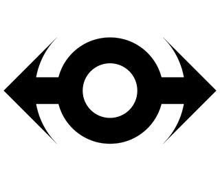

# Proppo
Proppo is an Automatic Propagation software library, a new type
of software designed for machine learning research and applications,
written in Python.
Automatic Propagation generalizes automatic differentiation, the
technology behind popular machine learning frameworks, such as
PyTorch, TensorFlow or JAX. In automatic differentiation, the
library automates computing the derivative of a program, by
caching necessary values in a node and propagating gradient
messages backwards; automatic propagation
generalizes this procedure by allowing the user to
define what information should be stored in the nodes, what messages
should be propagated backwards, and what computations should
be performed at the nodes. This way, many more algorithms besides
backpropagation can be implemented in a fashion that enables reusing
the code for other applications.

The basic building blocks of Automatic Propagation software
are the Propagators that determine what information is stored
in the node in the forward pass, and what computations are performed
in the backward pass. To implement a new algorithm, the user should
implement the propagators for their algorithm. To use an already
implemented algorithm by others, the user can download the propagators
and apply them in their code.

The currently implemented propagators mostly focus on
Monte Carlo gradient estimation, and the implementations
use the PyTorch library. The implemented algorithms are
reparameterization gradients, likelihood ration gradients,
total propagation and Gaussian shaping gradients.
In particular, there was previously no publicly available implementation
of total propagation or Gaussian shaping gradients. In our paper published
at NeurIPS 2022, we showed that in some situations, total propagation
can achieve orders of magnitude better gradient estimation accuracy
than what is possible with traditional automatic differentiation software.

Note that the software is a reseach prototype that still has many
rough edges and is continuously being developed and refactored.
Currently, the API is subject to sudden changes. We are aiming to
add many more features in the coming months. Current major ongoing
updates are the addition of smart initializers and container types,
and better functionality for modifying the propagation graph structure
and graph traversal order.

For an example application of Proppo, see the demo of the
PIPPS algorithm at https://github.com/proppo/pipps_demo

## Installation
Clone the repository, go into the parent directory and run
```
pip install -e .
```
To run the examples, you will also need torch, numpy and tqdm.

## Basic usage

See the "examples" folder for different ways in how the code can be used.

In general, the code to use Proppo will be split into 2: the
configuration code to determine what algorithm is being used,
and the program code that applies the algorithms in the application.
Often the program code can be kept the same, while only changing the
configuration code to switch between algorithms.
For example, a basic configuration code might be the following:

```
prop = RPProp()
manager = PropagationManager(default_propagator=prop)
```

Here, we set the reparameterization gradient as the algorithm
to be used. We could also use
prop = LRProp() or prop = TotalProp()
to instead use likelihood ratio gradients or total propagation
gradients.

To use the algorithm in the program, we use manager.forward()
at certain locations in the code, then finally call, manager.backward()
to run the backward pass of the algorithm.

For example, when simulating a recurrent neural network, rnn, the
code may be the following.

```
for _ in range(horizon_length):
    state = rnn(state)
    state = manager.forward(state)

loss = loss_func(state)
manager.backward(loss)
```

## Implementing a new algorithm in Proppo.
To implement a new algorithm, you have to define a new propagator
class by inheriting from an existing Propagator, and overwrite
the forward_impl and backward_impl methods. See the existing code
for several examples of propagators.

## Issues or problems.
If you have any issues when using the software, or need help
for a particular application, feel free to contact Paavo
(paavo [at] sys.i.kyoto-u.ac.jp).

## Citing.
If you found the library useful in your research then please
cite the NeurIPS paper "Proppo: a Message Passing Framework
for Customizable and Composable Learning Algorithms".


## Unit tests
Make unit tests for your changes. You can execute unit tests for the entire repository by the following command:
```
$ ./test
```

## Coding style
This repository is styled based on PEP8. You can automatically format the entire reposotory by the following command:
```
$ ./format
```

## Copyright
Copyright of Paavo Parmas. The main author is Paavo
Parmas. Takuma Seno also contributed code and knowhow to the software
engineering aspects of the project.

## Acknowledgements
This project was started under a Proof of Concept Program Grant from the
Okinawa Institute of Science and Technology (OIST) to develop a software library
based on Paavo Parmas' PhD Research at OIST.